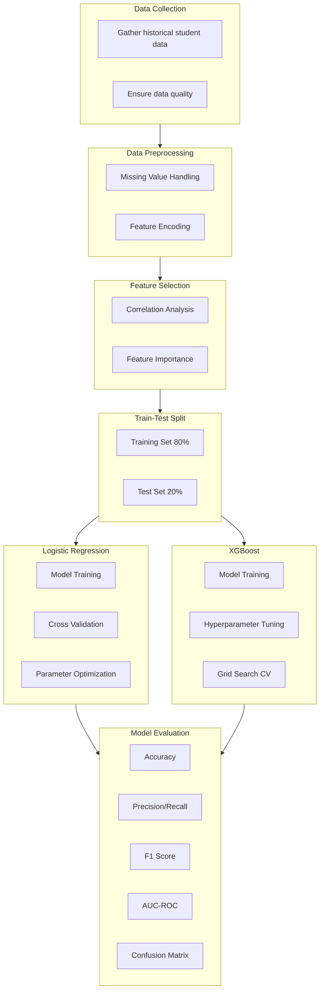

```mermaid

graph TD
    A[Data Collection]
    B[Data Preprocessing]
    C[Feature Selection]
    D[Train-Test Split]
    E[Logistic Regression]
    F[XGBoost]
    G[Model Evaluation]

    A --> B
    B --> C
    C --> D
    D --> E
    D --> F
    E --> G
    F --> G

    subgraph A[Data Collection]
        A1[Gather historical student data]
        A2[Ensure data quality]
    end

    subgraph B[Data Preprocessing]
        B1[Missing Value Handling]
        B2[Feature Encoding]
    end

    subgraph C[Feature Selection]
        C1[Correlation Analysis]
        C2[Feature Importance]
    end

    subgraph D[Train-Test Split]
        D1[Training Set 80%]
        D2[Test Set 20%]
    end

    subgraph E[Logistic Regression]
        E1[Model Training]
        E2[Cross Validation]
        E3[Parameter Optimization]
    end

    subgraph F[XGBoost]
        F1[Model Training]
        F2[Hyperparameter Tuning]
        F3[Grid Search CV]
    end

    subgraph G[Model Evaluation]
        G1[Accuracy]
        G2[Precision/Recall]
        G3[F1 Score]
        G4[AUC-ROC]
        G5[Confusion Matrix]
    end


```
